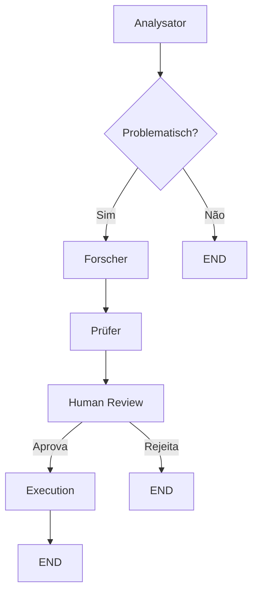

# 🛡️ KI-Moderations-System (Multi-Agenten)

Um sistema inteligente de moderação de conteúdo baseado em **Multi-Agentes com IA** e **Human-in-the-Loop**, desenvolvido com LangGraph, OpenAI e Streamlit.

## 🎯 O que é este projeto?

Este é um sistema de moderação de comentários que utiliza uma arquitetura multi-agentes para análise inteligente de conteúdo. A principal característica é que **agentes de IA trabalham em conjunto** para avaliar comentários, mas as decisões críticas sempre passam por **aprovação humana** antes de serem finalizadas.

## ✨ Principais Características

- 🤖 **4 Agentes Especializados**: Cada um com uma função específica
- 🔄 **Fluxo Condicional**: Comentários críticos seguem análise aprofundada
- 👤 **Human-in-the-Loop**: Moderadores humanos revisam e aprovam/rejeitam decisões
- 💾 **Memória de Conversa**: Mantém histórico de análises (thread-based)
- 📊 **Visualização do Workflow**: Diagrama do fluxo de processamento em tempo real
- 🚀 **Escalável**: Fácil adicionar novos agentes ou modificar regras

## 🏗️ Arquitetura

### Fluxo de Processamento

```
Usuário insere comentário
         ↓
    [Analysator Agent] - Classifica sentimento
         ↓
    [Conditional Edge] - É problemático?
      /            \
   SIM              NÃO
    ↓                ↓
[Forscher Agent]  [END]
Pesquisa regras
    ↓
[Prüfer Agent]
Consolida decisão
    ↓
[Human Review] ← ⚠️ PAUSA AQUI
Moderador aprova/rejeita
    ↓
[Execution Agent]
Finaliza ação
```

### Agentes

| Agente | Função | Entrada | Saída |
|--------|--------|---------|-------|
| **Analysator** | Analisa sentimento do comentário | Texto do comentário | Classificação: positivo/neutral/problematisch |
| **Forscher** | Busca regras de moderação relevantes | Análise anterior | Lista de regras aplicáveis |
| **Prüfer** | Consolida análise + regras em decisão | Análise + Regras | Recomendação final |
| **Execution** | Executa ação final | Decisão aprovada | Registra resultado |

## 🚀 Uso

### Online (Streamlit Cloud)

Acesse direto no navegador:
👉 **[https://multi-agenten-01.streamlit.app/](https://multi-agenten-01.streamlit.app/)**

1. Digite um comentário para moderação
2. Clique em "🚀 Analyse starten"
3. O sistema analisará em tempo real
4. Você verá a recomendação da IA
5. Aprove, edite ou rejeite o comentário

### Instalação Local

#### Pré-requisitos
- Python 3.9+
- Chave de API OpenAI (https://platform.openai.com/api-keys)

#### Passos

1. **Clone o repositório**
```bash
git clone https://github.com/RuanaRamos/Multi-Agenten.git
cd Multi-Agenten
```

2. **Crie um ambiente virtual**
```bash
python -m venv venv
source venv/bin/activate  # Windows: venv\Scripts\activate
```

3. **Instale dependências**
```bash
pip install -r requirements.txt
```

4. **Configure as secrets**
```bash
# Crie arquivo .streamlit/secrets.toml
mkdir -p .streamlit
echo 'OPENAI_API_KEY = "sk-proj-..."' > .streamlit/secrets.toml
```

5. **Execute a aplicação**
```bash
streamlit run streamlit_app.py
```

A app abrirá em `http://localhost:8501`

## 📦 Estrutura do Projeto

```
Multi-Agenten/
├── agents.py              # Define os 4 agentes especializados
├── graph.py               # Configura o workflow (LangGraph)
├── streamlit_app.py       # Interface web (Streamlit)
├── main.py                # Alias do streamlit_app.py
├── app.py                 # Alias do streamlit_app.py
├── requirements.txt       # Dependências Python
├── .streamlit/
│   └── config.toml        # Configuração do Streamlit
├── .gitignore             # Protege secrets e .env
└── README.md              # Este arquivo
```

### Dependências Principais

- **Streamlit** (1.36.0+): Interface web interativa
- **LangGraph** (0.2.0+): Framework para workflows com grafos
- **OpenAI** (1.50.0+): API para modelos de linguagem
- **LangChain OpenAI** (0.2.0+): Integração LangChain-OpenAI
- **python-dotenv** (1.0.0+): Carregamento de variáveis de ambiente

## 🔐 Configuração de Secrets

### Streamlit Cloud

1. Vá em: https://share.streamlit.io/apps
2. Selecione sua app
3. **Settings** → **Secrets**
4. Adicione:
```toml
OPENAI_API_KEY = "sk-proj-sua-chave-aqui"
```
5. Clique **Save** (a app reiniciará automaticamente)

### Local (Development)

Crie `.streamlit/secrets.toml`:
```toml
OPENAI_API_KEY = "sk-proj-sua-chave-aqui"
TAVILY_API_KEY = "tvly-sua-chave-aqui"  # Opcional
```

⚠️ **IMPORTANTE**: Este arquivo está em `.gitignore` e não será commitado.

## 🛠️ Customizações

### Mudar Modelo de IA

Edite `agents.py`:
```python
# Linha 22 e 53
model="gpt-4o-mini"  # Mude para gpt-4, gpt-3.5-turbo, etc
```

### Adicionar Novo Agente

1. Crie função em `agents.py`:
```python
def seu_novo_agent(state):
    """Descrição do agente"""
    return {"nova_chave": "valor"}
```

2. Adicione ao workflow em `graph.py`:
```python
workflow.add_node("seu_agente", seu_novo_agent)
workflow.add_edge("agente_anterior", "seu_agente")
```

### Modificar Fluxo

Edite as regras condicionais em `graph.py`:
```python
def pruefe_forschungs_bedarf(state):
    if state["agenten_analyse"] == "problematisch":
        return "forscher"
    return "direkt_genehmigen"
```

## 📊 Exemplo de Uso

**Entrada:**
```
"Este curso é excelente! Recomendo para todos!"
```

**Fluxo:**
1. ✅ Analysator: Classifica como "positiv"
2. ⏭️ Fluxo direto (sem pesquisa de regras)
3. ✅ Prüfer: Gera recomendação de aprovação
4. ⏸️ Espera aprovação humana
5. ✅ Moderador aprova
6. ✅ Execution: Registra aprovação

**Saída:**
```
Moderations-Status: Genehmigt
KI-Begründung: "Comentário positivo e construtivo. Sem violações de regras."
```

## 🔄 Workflow Visual

A app exibe um diagrama Mermaid do workflow em tempo real:



## 🚨 Resolução de Problemas

### ❌ AuthenticationError
**Causa:** Chave OpenAI inválida ou expirada
**Solução:**
1. Acesse https://platform.openai.com/api-keys
2. Gere uma nova chave
3. Atualize em Streamlit Secrets

### ❌ OPENAI_API_KEY não encontrada
**Causa:** Secrets não configuradas
**Solução:**
- Streamlit Cloud: Settings → Secrets
- Local: Crie `.streamlit/secrets.toml`

### ❌ ModuleNotFoundError
**Causa:** Dependências não instaladas
**Solução:**
```bash
pip install -r requirements.txt
```

## 📈 Métricas e Monitoramento

Atualmente, a app registra:
- Comentários analisados
- Classificações de sentimento
- Decisões aprovadas/rejeitadas
- Tempo de processamento (em logs)

Para produção, considere adicionar:
- Banco de dados para histórico
- Dashboard de métricas
- Alertas para padrões suspeitos

## 🤝 Contribuindo

Contribuições são bem-vindas! Para contribuir:

1. Faça um fork do repositório
2. Crie uma branch (`git checkout -b feature/nova-funcionalidade`)
3. Commit suas mudanças (`git commit -m 'Add nova funcionalidade'`)
4. Push para a branch (`git push origin feature/nova-funcionalidade`)
5. Abra um Pull Request

## 📝 Licença

Este projeto está licenciado sob a MIT License - veja o arquivo LICENSE para detalhes.

## 👤 Autor

**Ruana Ramos**
- GitHub: [@RuanaRamos](https://github.com/RuanaRamos)
- Email: ruanarbarbosa2@icloud.com

## 🔗 Links Úteis

- 🌐 **App em Produção**: [https://multi-agenten-01.streamlit.app/](https://multi-agenten-01.streamlit.app/)
- 📚 **LangGraph Docs**: https://langchain-ai.github.io/langgraph/
- 🤖 **OpenAI API**: https://platform.openai.com/docs
- 🎯 **Streamlit Docs**: https://docs.streamlit.io

## 🙏 Agradecimentos

- OpenAI pelo GPT-4o-mini
- LangChain/LangGraph pela orquestração de agentes
- Streamlit pela interface web elegante

---

**⭐ Se este projeto foi útil, deixe uma estrela!**
