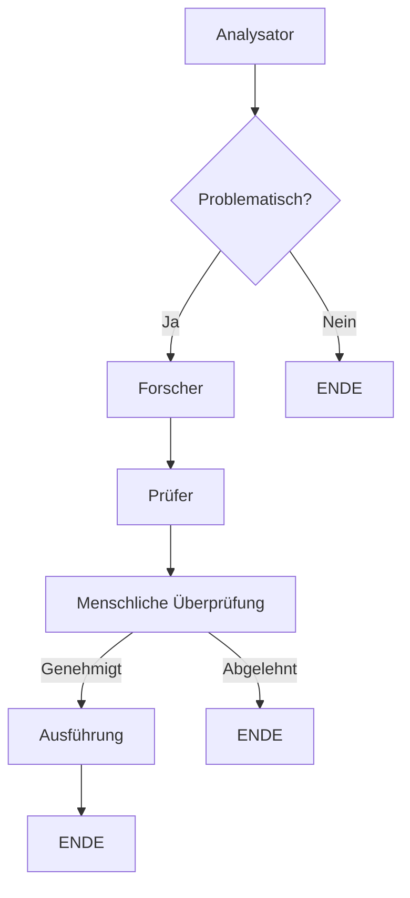

# 🛡️ KI-Moderations-System (Multi-Agenten)

Ein intelligentes Inhaltsmoderierungssystem basierend auf **Multi-Agenten mit KI** und **Human-in-the-Loop**, entwickelt mit LangGraph, OpenAI und Streamlit.

## 🎯 Was ist dieses Projekt?

Dies ist ein System zur Moderation von Kommentaren, das eine **Multi-Agenten-Architektur** nutzt, um Inhalte intelligenter zu analysieren. Die Hauptmerkmale sind, dass **KI-Agenten zusammenarbeiten**, um Kommentare zu bewerten, aber kritische Entscheidungen werden immer von **Menschen vor Abschluss genehmigt**.

## ✨ Hauptmerkmale

- 🤖 **4 spezialisierte Agenten**: Jeder mit einer spezifischen Funktion
- 🔄 **Bedingter Fluss**: Kritische Kommentare folgen einer eingehenden Analyse
- 👤 **Human-in-the-Loop**: Moderatoren überprüfen und genehmigen/lehnen Entscheidungen ab
- 💾 **Gesprächsverlauf**: Behält Analyseverlauf bei (Thread-basiert)
- 📊 **Workflow-Visualisierung**: Echtzeit-Diagramm des Verarbeitungsflusses
- 🚀 **Skalierbar**: Einfach neue Agenten hinzufügen oder Regeln ändern

## 🏗️ Architektur

### Verarbeitungsfluss

```
Benutzer gibt Kommentar ein
         ↓
    [Analysator-Agent] - Klassifiziert Sentiment
         ↓
    [Bedingter Rand] - Ist problematisch?
      /            \
   JA               NEIN
    ↓                ↓
[Forscher-Agent]  [ENDE]
Sucht Regeln
    ↓
[Prüfer-Agent]
Konsolidiert Entscheidung
    ↓
[Menschliche Überprüfung] ← ⚠️ PAUSE HIER
Moderator genehmigt/lehnt ab
    ↓
[Ausführungs-Agent]
Finalisiert Aktion
```

### Agenten

| Agent | Funktion | Eingabe | Ausgabe |
|-------|----------|---------|---------|
| **Analysator** | Analysiert Sentiment des Kommentars | Kommentartext | Klassifizierung: positiv/neutral/problematisch |
| **Forscher** | Sucht relevante Moderationsregeln | Vorherige Analyse | Liste anwendbarer Regeln |
| **Prüfer** | Konsolidiert Analyse + Regeln in Entscheidung | Analyse + Regeln | Endgültige Empfehlung |
| **Ausführung** | Führt endgültige Aktion aus | Genehmigte Entscheidung | Registriert Ergebnis |

## 🚀 Verwendung

### Online (Streamlit Cloud)

Direkt im Browser zugreifen:
👉 **[https://multi-agenten-01.streamlit.app/](https://multi-agenten-01.streamlit.app/)**

1. Geben Sie einen Kommentar zur Moderation ein
2. Klicken Sie auf "🚀 Analyse starten"
3. Das System analysiert in Echtzeit
4. Sie sehen die Empfehlung der KI
5. Genehmigen, bearbeiten oder lehnen Sie den Kommentar ab

### Lokale Installation

#### Voraussetzungen
- Python 3.9+
- OpenAI API-Schlüssel (https://platform.openai.com/api-keys)

#### Schritte

1. **Repository klonen**
```bash
git clone https://github.com/RuanaRamos/Multi-Agenten.git
cd Multi-Agenten
```

2. **Virtuelle Umgebung erstellen**
```bash
python -m venv venv
source venv/bin/activate  # Windows: venv\Scripts\activate
```

3. **Abhängigkeiten installieren**
```bash
pip install -r requirements.txt
```

4. **Secrets konfigurieren**
```bash
# Erstellen Sie die Datei .streamlit/secrets.toml
mkdir -p .streamlit
echo 'OPENAI_API_KEY = "sk-proj-..."' > .streamlit/secrets.toml
```

5. **Anwendung starten**
```bash
streamlit run streamlit_app.py
```

Die App öffnet sich unter `http://localhost:8501`

## 📦 Projektstruktur

```
Multi-Agenten/
├── agents.py              # Definiert die 4 spezialisierten Agenten
├── graph.py               # Konfiguriert den Workflow (LangGraph)
├── streamlit_app.py       # Web-Oberfläche (Streamlit)
├── requirements.txt       # Python-Abhängigkeiten
├── .streamlit/
│   └── config.toml        # Streamlit-Konfiguration
├── .gitignore             # Schützt Secrets und .env
└── README.md              # Diese Datei
```

### Hauptabhängigkeiten

- **Streamlit** (1.36.0+): Interaktive Web-Oberfläche
- **LangGraph** (0.2.0+): Framework für Workflows mit Graphen
- **OpenAI** (1.50.0+): API für Sprachmodelle
- **LangChain OpenAI** (0.2.0+): LangChain-OpenAI-Integration
- **python-dotenv** (1.0.0+): Laden von Umgebungsvariablen

## 🔐 Konfiguration von Secrets

### Streamlit Cloud

1. Gehen Sie zu: https://share.streamlit.io/apps
2. Wählen Sie Ihre App
3. **Settings** → **Secrets**
4. Hinzufügen:
```toml
OPENAI_API_KEY = "sk-proj-your-key-here"
```
5. Klicken Sie **Save** (die App wird automatisch neu gestartet)

### Lokal (Entwicklung)

Erstellen Sie `.streamlit/secrets.toml`:
```toml
OPENAI_API_KEY = "sk-proj-your-key-here"
TAVILY_API_KEY = "tvly-your-key-here"  # Optional
```

⚠️ **WICHTIG**: Diese Datei ist in `.gitignore` und wird nicht committed.

## 🛠️ Anpassungen

### KI-Modell ändern

Bearbeiten Sie `agents.py`:
```python
# Zeile 22 und 53
model="gpt-4o-mini"  # Ändern Sie zu gpt-4, gpt-3.5-turbo, etc.
```

### Neuen Agenten hinzufügen

1. Erstellen Sie eine Funktion in `agents.py`:
```python
def ihr_neuer_agent(state):
    """Beschreibung des Agenten"""
    return {"neuer_schlüssel": "wert"}
```

2. Fügen Sie es zum Workflow in `graph.py` hinzu:
```python
workflow.add_node("ihr_agent", ihr_neuer_agent)
workflow.add_edge("vorheriger_agent", "ihr_agent")
```

### Fluss modifizieren

Bearbeiten Sie die bedingten Regeln in `graph.py`:
```python
def pruefe_forschungs_bedarf(state):
    if state["agenten_analyse"] == "problematisch":
        return "forscher"
    return "direkt_genehmigen"
```

## 📊 Verwendungsbeispiel

**Eingabe:**
```
"Dieser Kurs ist ausgezeichnet! Ich empfehle ihn jedem weiter!"
```

**Fluss:**
1. ✅ Analysator: Klassifiziert als "positiv"
2. ⏭️ Direkter Fluss (keine Regelsuche)
3. ✅ Prüfer: Generiert Genehmigungsempfehlung
4. ⏸️ Wartet auf Genehmigung durch Menschen
5. ✅ Moderator genehmigt
6. ✅ Ausführung: Registriert Genehmigung

**Ausgabe:**
```
Moderationsstatus: Genehmigt
KI-Begründung: "Positiver und konstruktiver Kommentar. Keine Regelverstoße."
```

## 🔄 Workflow-Visualisierung

Die App zeigt ein Mermaid-Diagramm des Workflows in Echtzeit:



## 🚨 Fehlerbehebung

### ❌ AuthenticationError
**Ursache:** Ungültiger oder abgelaufener OpenAI-Schlüssel  
**Lösung:**
1. Besuchen Sie https://platform.openai.com/api-keys
2. Generieren Sie einen neuen Schlüssel
3. Aktualisieren Sie in Streamlit Secrets

### ❌ OPENAI_API_KEY nicht gefunden
**Ursache:** Secrets nicht konfiguriert  
**Lösung:**
- Streamlit Cloud: Settings → Secrets
- Lokal: Erstellen Sie `.streamlit/secrets.toml`

### ❌ ModuleNotFoundError
**Ursache:** Abhängigkeiten nicht installiert  
**Lösung:**
```bash
pip install -r requirements.txt
```

## 📈 Metriken und Überwachung

Derzeit protokolliert die App:
- Analysierte Kommentare
- Sentiment-Klassifizierungen
- Genehmigte/abgelehnte Entscheidungen
- Verarbeitungszeit (in Logs)

Für die Produktion empfehlen wir:
- Datenbank für Verlauf
- Metriken-Dashboard
- Benachrichtigungen für verdächtige Muster

## 🤝 Beitragen

Beiträge sind willkommen! Um beizutragen:

1. Forken Sie das Repository
2. Erstellen Sie einen Branch (`git checkout -b feature/neue-funktion`)
3. Committen Sie Ihre Änderungen (`git commit -m 'Neue Funktion hinzufügen'`)
4. Pushen Sie zum Branch (`git push origin feature/neue-funktion`)
5. Öffnen Sie einen Pull Request

## 📝 Lizenz

Dieses Projekt ist unter der MIT-Lizenz lizenziert - siehe die LICENSE-Datei für Details.

## 👤 Autor

**Ruana Ramos**
- GitHub: [@RuanaRamos](https://github.com/RuanaRamos)
- Email: ruanarbarbosa2@icloud.com

## 🔗 Nützliche Links

- 🌐 **App in Produktion**: [https://multi-agenten-01.streamlit.app/](https://multi-agenten-01.streamlit.app/)
- 📚 **LangGraph Dokumentation**: https://langchain-ai.github.io/langgraph/
- 🤖 **OpenAI API**: https://platform.openai.com/docs
- 🎯 **Streamlit Dokumentation**: https://docs.streamlit.io

## 🙏 Danksagungen

- OpenAI für GPT-4o-mini
- LangChain/LangGraph für die Agenten-Orchestrierung
- Streamlit für die elegante Web-Oberfläche

---

**⭐ Wenn dieses Projekt hilfreich war, geben Sie bitte einen Stern!**
